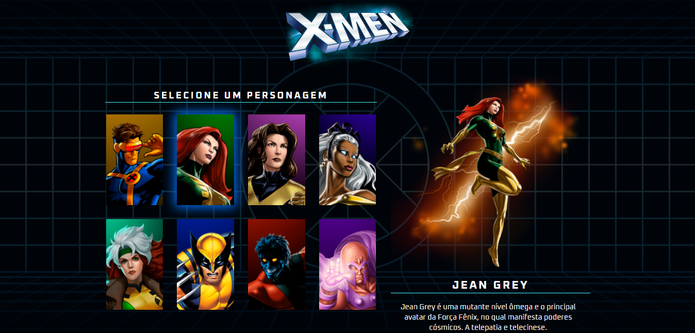
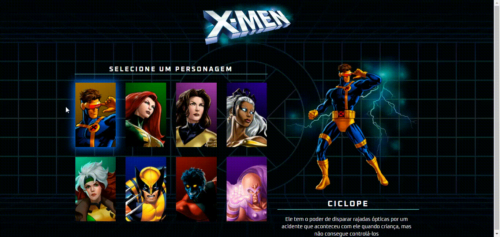
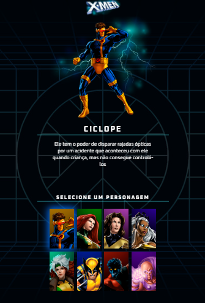

# Projeto X-MEN

Projeto Web onde desenvolvi um sistema de seleção de personagem dos X-MEN, utilizando <b>HTML, CSS</b> e <b>JAVASCRIPT</b>

<h6 align="center"> <a href="https://jean-carlo-torres.github.io/x-men/"> **Link para testar o projeto **</a> </h6>

<h3>Trilha de aprendizagem, que foi abordado durante a produção desse projeto.</h3>
<ol>
	<li> <b>HTML:</b> Para a estruturação do menu.</li>
	<li> <b>CSS:</b> Para a estilização/posicionamento das imagens e acessibilidade para dispositivos mobile.</li>
	<li> <b>JAVASCRIPT:</b> Para criar as funções:
<ul>
        <li>Remover/adicionar seleção no personagem selecionado.</li>
        <li>Alterar imagem do personagem selecionado.</li>
        <li>Alterar nome e descrição do personagem selecionado.</li>
</ul>
     </li>
</ol>
 

<h3>Contribuindo</h3>

⭐️ Star o projeto

🐛 Encontrar e relatar issues

